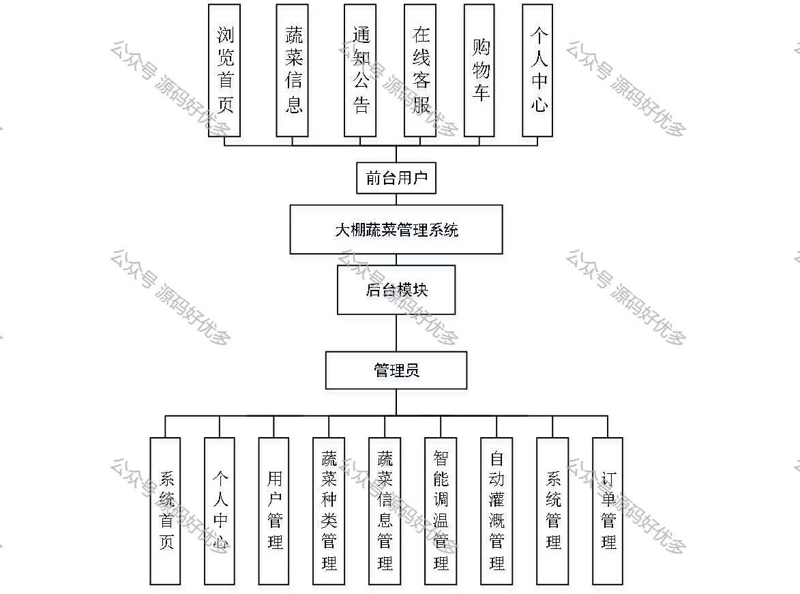
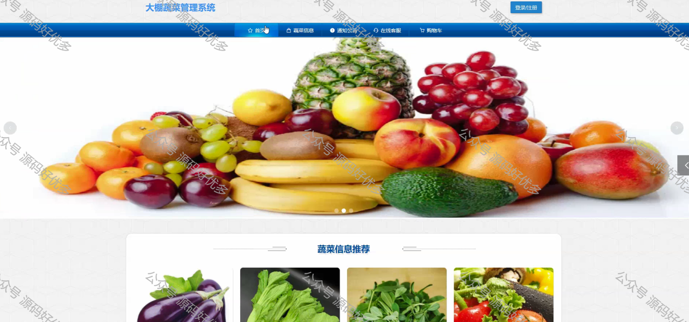
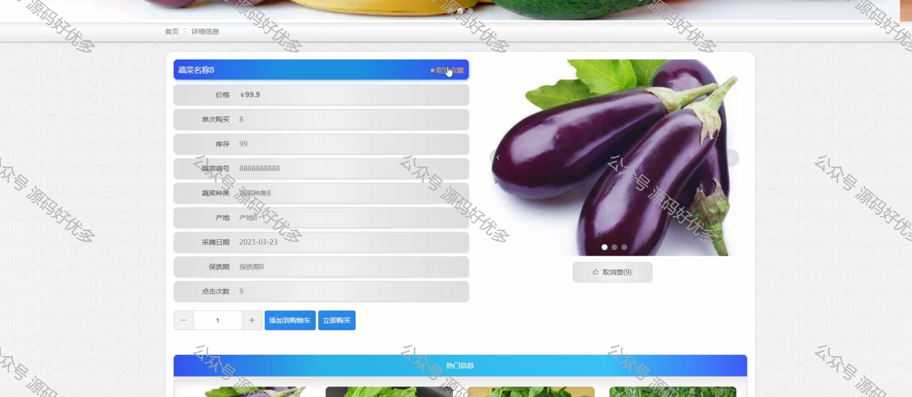
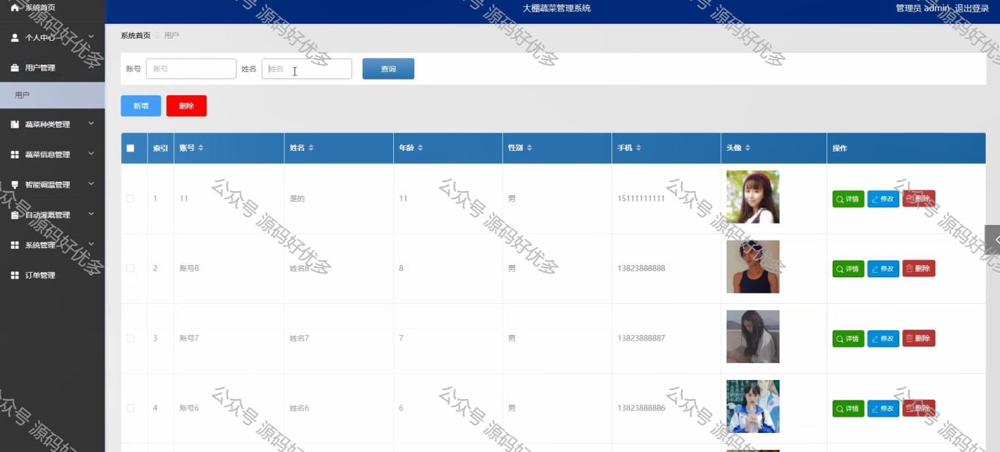
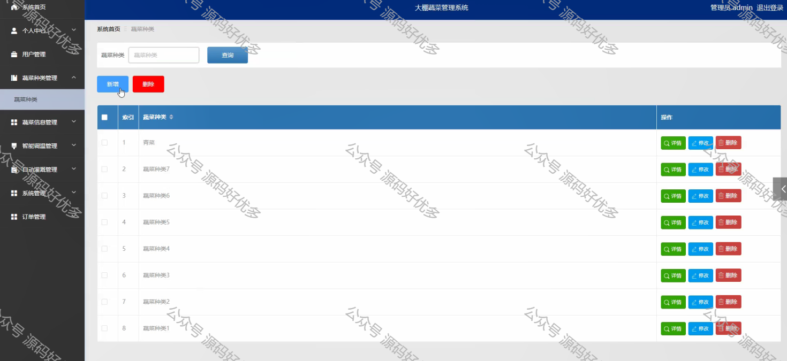
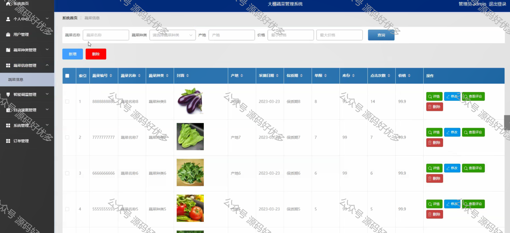
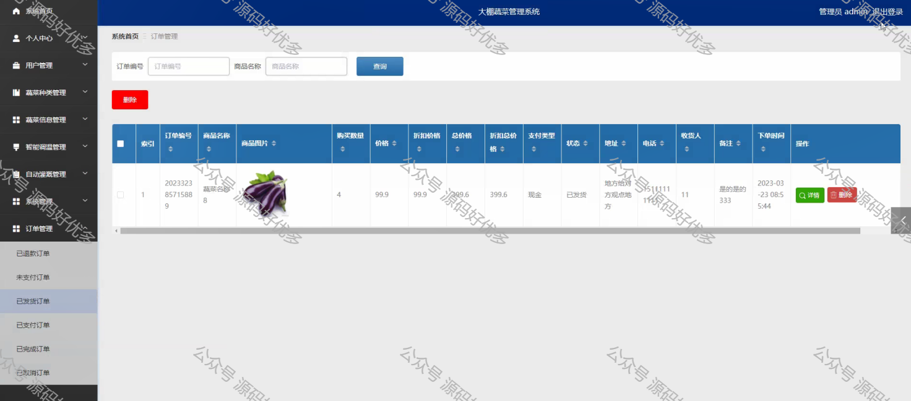

 
## 查看主页获取源码

> **作者介绍**： **✌**全网粉丝10W+本平台特邀作者、博客专家、CSDN新星计划导师、java领域优质创作者,博客之星、掘金/华为云/阿里云/InfoQ等平台优质作者、专注于项目实战 **✌**

  

### 一、作品包含

源码+数据库+设计文档万字+PPT+全套环境和工具资源+部署教程

### 二、项目技术

前端技术：Html、Css、Js、Vue、Element-ui

数据库：MySQL

后端技术：Java、Spring Boot、MyBatis

  

### 三、运行环境

开发工具：IDEA/eclipse

数据库：MySQL5.7

数据库管理工具：Navicat10以上版本

环境配置软件： JDK1.8+Maven3.6.3

前端Nodejs：14

  

### 四、项目介绍
项目编号：springbootA075

本文讲述了大棚蔬菜管理系统。结合电子管理系统的特点，分析了大棚蔬菜管理系统的背景，给出了大棚蔬菜管理系统实现的设计方案。
本文主要完成不同用户的权限划分，不同用户具有不同权限的操作功能，在用户模块，主要有用户进行注册和登录，用户可以实现查看蔬菜信息、通知公告、在线客服，还能修改个人信息等；在管理员模块，管理员可以对用户、蔬菜种类、蔬菜信息、智能调温、自动灌溉、系统和订单等进行相应的操作。
3.学生端：查看教师发布的学习视频，完成教师布置的作业，申请加入某个班级等等

### 五、运行截图

  

